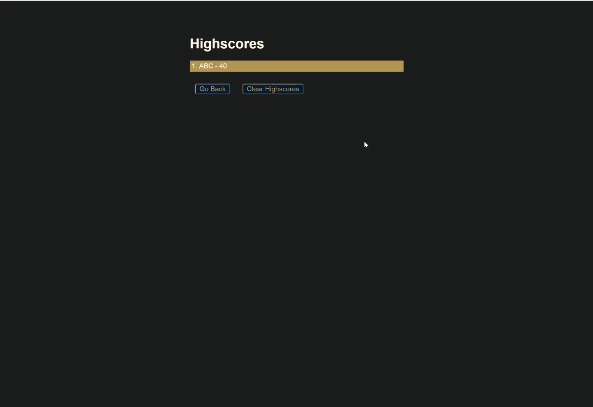

# W6-Timed-Quiz

## Description
The application is a coding quiz that challenges users with questions on HTML, CSS, and JavaScript. Each question has a time limit, and users receive immediate feedback and a final score based on their answers. It also allows users to submit their scores for inclusion on a high-score list that is stored locally.

## Folder Structure

- **index.html**: The Main HTML file for this timed quiz.
- **highscores.html**: The additional HTML file for displaying high scores.
- **asset:** includes 3 subfolders for styles (css), JavaScript & audio files.
  - **css:** css file for styling.
  - **js:** JavaScript files, logic.js for the quiz logic, questions.js for storing quiz questions, scores.js for print high scores.
    - **sfx:** sound effects files used in the project, such as correct.wav and incorrect.wav.
- **screencapture:** includes 4 screenshot images.
  - **screencapture-W6-Timed-Quiz-1.jpg:** Screenshot for the start page.
  - **screencapture-W6-Timed-Quiz-2.jpg:** Screenshot for the question page.
  - **screencapture-W6-Timed-Quiz-3.jpg:** Screenshot for the submit page.
  - **screencapture-W6-Timed-Quiz-4.jpg:** Screenshot for the highscores.html.
- **README.md:** This file.

## Links

[Visit my application](https://celia103.github.io/W6-Timed-Quiz/)

[Visit the GitHub repository](https://github.com/celia103/W6-Timed-Quiz)

- Application Screenshot:

- Screenshot for using the password generator:

- Screenshot for score generated:

## License

MIT License
